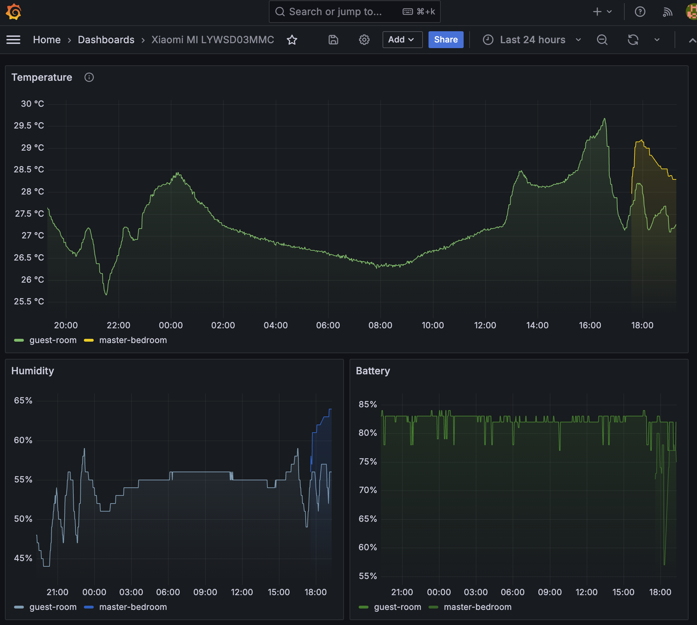

## mi-sensors-exporter

## Table of Contents
- [Introduction](#introduction)
- [Features](#features)
- [Installation](#installation)
- [Good to know](#what-to-know)

### Introduction
A docker compose image with Prometheus exporter written in Python for Xiaomi Mi LYWSD03MMC

Features:
  • Monitor your sensors inside a docker image
  • Export metrics into Prometheus
  • Visualize them via Grafana



### Installation
1. Clone the repository:
   ```sh
   git clone https://github.com/haodemon/mi-sensors-exporter.git
   cd mi-sensors-exporter
   ```
2. Modify the configuration and add the names and the MAC addresses of your sensors:
   ```sh
   vim app/config.json
   ```

3. Start the container:
   ```sh
   docker compose up -d
   ``` 
4. Scrap the metrics into Prometheus:
   ```sh
   - job_name: mi_temperature_sensor
     honor_timestamps: true
     metrics_path: /metrics
     scheme: http
     static_configs:
     - targets:
       - <ip>:8083
   ``` 
5. Setup Grafana dashboard:

    Import the dashboard from grafana/dashboards/mi-sensors-exporter.json


### What to know
- Sometimes the sensor does not respond to the request (as its broadcast times are limited), so the exporter will return the last known value:
```
mi_sensor_service  | 2024-09-29 16:25:27,686 - ERROR - Failed to fetch data for <lywsd03mmc.lywsd03mmc.Lywsd03mmcClient object at 0x78395ae6a4b0>: Failed to connect to peripheral A4:C1:38:BE:BD:18, addr type: public
```

- By default, the sensors are scanned every minute (60s), you can change the interval `app/config.json`: `interval`
